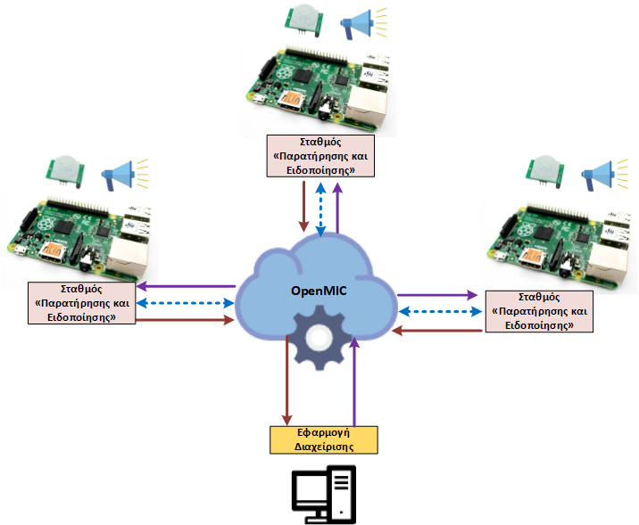

# Σύστημα ασφαλής εκκένωσης κτιρίων

## Περιγραφή
Σχεδιάσαμε και υλοποιήσαμε ένα ευφυές σύστημα που βοηθά στην ασφαλή εκκένωση κτιρίων (π.χ. σχολεία, δημόσιες υπηρεσίες) σε περίπτωση έκτακτης ανάγκης όπως πυρκαγιές, σεισμοί κλπ.  Ένα σημαντικό σημείο διαφοροποίησης της συγκεκριμένης πρότασης σε σχέση με άλλα παρόμοια συστήματα είναι η υποστήριξη της δυνατότητας συνεργασίας μεταξύ των επιμέρους σταθμών «παρατήρησης και ειδοποίησης» καθώς και της απομακρυσμένης διαχείρισης τους. 

Η συνεργασία επιτρέπει στους σταθμούς να ενημερώνονται άμεσα και αυτοματοποιημένα για συγκεκριμένα γεγονότα από κάποιον άλλο σταθμό, με συνέπεια να προσαρμόζουν κατάλληλα τις οδηγίες που παρέχουν προς τους πολίτες ώστε να ταιριάζουν πάντα με τις συγκεκριμένες συνθήκες που επικρατούν. 

Γενικότερα, το σύστημα αποτελείται από ένα κέντρο ελέγχου και μια σειρά από επιμέρους σταθμούς «παρατήρησης και ειδοποίησης» που βρίσκονται τοποθετημένοι σε συγκεκριμένα σημεία σε κάποιο  κτίριο. Μια γενική περιγραφή παρουσιάζεται στο παρακάτω σχήμα.



Κάθε σταθμός βασίζεται αποκλειστικά σε ανοιχτό υλικό και περιλαμβάνει: 
* ένα Raspberry Pi 3 
* ένα αισθητήρα εντοπισμού φωτιάς ή ένα αισθητήρα εντοπισμού αερίων
* ένα μπλε LED, που αναβοσβήνει και αντιστοιχεί στην περίπτωση που δεν υπάρχει οποιοδήποτε έκτακτο γεγονός 
* ένα κόκκινο LED, που αναβοσβήνει όταν έχει εντοπιστεί κάποιο έκτακτο γεγονός (είτε από τον ίδιο τον σταθμό είτε από κάποιον άλλον) και αντιστοιχεί στην περίπτωση που ο σταθμός παίζει κάποιο μήνυμα εκκένωσης
* ένα φορητό ηχείο, για την αναπαραγωγή των ηχογραφημένων μηνυμάτων


## Εγκατάσταση

Για την χρήση του συστήματος θα πρέπει υποχρεωτικά να έχει προηγηθεί η εγκατάσταση της βιβλιοθήκης OpenMIC τόσο στο μηχάνημα που θα φιλοξενεί το κέντρο ελέγχου όσο και σε όλα τα Raspberry Pi.  Αναλυτικές πληροφορίες για την εγκατάσταση της βιβλιοθήκης υπάρχουν στο σύνδεσμο LINK STO OPENMIC INSTALLATION.

Στη συνέχεια θα πρέπει να εγκατασταθούν σε όλα τα μηχανήματα οι αναγκαίες βιβλιοθήκες (PyQt5 και pygame):
```
# sudo apt-get install python3-pyqt5
# sudo pip3 install pygame
```

Επιπλέον, θα πρέπει να υπάρχει σύνδεση μεταξύ του κέντρου ελέγχου και των σταθμών εργασίας ώστε να μπορούν να ανταλλάσσουν τα απαραίτητα μηνύματα. Έτσι, θα πρέπει να ρυθμιστούν κατάλληλα οι παράμετροι επικοινωνίας στην εφαρμογή του κέντρου ελέγχου (<i>αρχείο ControlMonitor.py , μέθοδος setup_openmic_controller()</i> )  και των σταθμών (<i> αρχείο MonitoringStation.py , μέθοδος __init__() </i>). Περισσότερες πληροφορίες για τις παραμέτρους σύνδεσης υπάρχουν στην σελίδα περιγραφής της βιβλιοθήκης OpenMIC LINK STO OPENMIC DESCRIPTION.

Γενικότερα, το σύστημα αντιστοιχεί στην περίπτωση που η βιβλιοθήκη OpenMIC μας παρέχει τη δυνατότητα τόσο για κεντρικό έλεγχο πολλαπλών Raspberry Pi συσκευών όσο και τη δυνατότητα συνεργασίας μεταξύ τους μέσω της άμεσης ανταλλαγής μηνυμάτων.

Στη συνέχεια θα πρέπει σε κάθε σταθμό «παρατήρησης και ειδοποίησης» να συνδεθούν οι αισθητήρες και τα LEDs στα προκαθορισμένα GPIO pins με τα οποία έχει προγραμματιστεί η εφαρμογή. Στο σχήμα που ακολουθεί παρουσιάζουμε το κύκλωμα και τις απαραίτητες συνδέσεις. Τέλος, θα πρέπει να συνδέσουμε ένα εξωτερικό φορητό ηχείο στο Raspberry Pi στην αντίστοιχη είσοδο.
 
Έχοντας ολοκληρώσει τα παραπάνω βήματα θα έχουμε πλέον ένα ολοκληρωμένο σταθμό «παρατήρησης και ειδοποίησης» όπως φαίνεται στο παρακάτω εικόνα.
 

Σε αντίθεση με την βιβλιοθήκη OpenMIC που υπάρχει η δυνατότητα κεντρικής  εγκατάστασης σε κάποιο υπολογιστή μέσω της εκτέλεσης της αντίστοιχης εντολής,  για την περίπτωση του συστήματος ασφαλής εκκένωσης κτιρίων απλά πηγαίνουμε στους αντίστοιχους φακέλους και εκτελούμε τις εφαρμογές. Αν θέλουμε να μεταφέρουμε σε διαφορετική θέση από εκείνη που έγιναν clone θα πρέπει η μεταφορά να περιλαμβάνει το πλήρες περιεχόμενο του κάθε υπο-φακέλου (<i>/examples/emergency/station/   &  /examples/emergency/control_monitor/</i>) και όχι μόνο το κεντρικό αρχείο κάθε εφαρμογής (<i> ControlMonitor.py & MonitoringStation.py </i>).

Για την έναρξη της εκτέλεσης του κέντρου ελέγχου αφού είμαστε στον αντίστοιχο φάκελο εκτελούμε απλά την εντολή:
```
# python3 ControlMonitor.py
```

Για την εκτέλεση του σταθμού «παρατήρησης και ειδοποίησης» αφού είμαστε στον αντίστοιχο φάκελο εκτελούμε την εντολή με το κατάλληλα όρισμα (0 ή 1 ή 2 ή 3) για να προσδιορίσουμε ποιος συγκεκριμένες σταθμός είναι. 
```
# python3 MonitoringStation.py  [0|1|2|3]
```

<i>Σημείωση</i>: Θα πρέπει για κάθε σταθμό να προσδιορίζουμε διαφορετικό όρισμα για να μπορεί το σενάριο να εκτελείται σωστά και να ακούμε τα κατάλληλα ηχητικά μηνύματα. Αν εκτελούμε το σενάριο με λιγότερους σταθμούς πάλι σημαντικό είναι να διαλέγουμε διαφορετικά ορίσματα και όχι τόσο ποια θα επιλέξουμε.

## Λειτουργία

Έχοντας ακολουθήσει τις οδηγίες που περιγράφονται στην ενότητα εγκατάστασης θα πρέπει πλέον να υπάρχει  σε κάποιον υπολογιστή ή Raspberry Pi εγκατεστημένη, ρυθμισμένη και να τρέχει η εφαρμογή για το κέντρο ελέγχου και στα τέσσερα απαιτούμενα Raspberry Pi η εφαρμογή  που αντιστοιχεί στο σταθμό «παρατήρησης και ειδοποίησης» καθώς και τα σχετικά κυκλώματα.

Μετά από ελάχιστα δευτερόλεπτα όλοι οι σταθμοί θα έχουν επικοινωνήσει με το κέντρο ελέγχου και η γραφική διεπαφή του κέντρο ελέγχου θα πρέπει να είναι όπως η παρακάτω εικόνα.

Πλέον, μπορούμε να δοκιμάσουμε την εφαρμογή.  Αν επιλέξουμε το κουμπί το ηχητικού ελέγχου τότε θα πρέπει να ακούσουμε από όλους τους σταθμούς παρατήρησης ένα σύντομο κουδούνισμα.  Αν επιλέξουμε το κουμπί για τα LEDs τότε θα δούμε να αλλάζει μεταξύ των δύο προκαθορισμένων τιμών ο ρυθμός με τον οποίο αναβοσβήνει το μπλε LED σε κάθε σταθμό. 

Τέλος, μπορούμε με την χρήση ενός αναπτήρα να προκαλέσουμε κάποιο έκτακτο γεγονός σε οποιονδήποτε σταθμό. Αμέσως, ο συγκεκριμένος σταθμός θα αρχίσει να εκπέμπει το κατάλληλο ηχογραφημένο μήνυμα και θα ενημερώσει το κέντρο ελέγχου και όλους τους άλλους σταθμούς για το γεγονός. Επίσης, τοπικά σταματάει να αναβοσβήνει το μπλε LED και αρχίζει το κόκκινο. Μετά από ελάχιστο χρόνο το μήνυμα θα φτάσει στο κέντρο ελέγχου και θα ακουστεί μια μικρή σειρήνα ενώ στη γραφική διεπαφή ο διαχειριστής μπορεί να δει πιο συγκεκριμένος σταθμός έστειλε το μήνυμα, άρα να γνωρίζει που είναι το πρόβλημα ώστε να κάνει τις κατάλληλες ενέργειες. Ταυτόχρονα το μήνυμα θα φτάσει σε όλους τους σταθμούς που με βάση τη θέση τους και τη θέση του προβλήματος θα αρχίσουν να παίζουν συνεχώς το κατάλληλο ηχογραφημένο μήνυμα. Οι σταθμοί κάθε φορά που λαμβάνουν ένα μήνυμα για έκτακτο γεγονός από κάποιο άλλο σταθμό πάντα ελέγχουν ποιες είναι οι σωστές οδηγίες διαφυγής και ακόμη και αν μεταδίδουν ήδη κάποια αν χρειαστεί τότε την ανανεώνουν με τις κατάλληλες οδηγίες.

Τα διάφορα σενάρια που υποστηρίζονται και τα αναμενόμενα ηχητικά μηνύματα συνοψίζονται στον πίνακα που υπάρχει στην ενότητα της περιγραφής.

Για να εκτελέσουμε κάποιο διαφορετικό σενάριο έκτακτου γεγονότος θα πρέπει να κλείσουμε τόσο την εφαρμογή του κέντρο ελέγχου όσο και τις εφαρμογές στους τέσσερις σταθμούς παρατήρησης και στη συνέχεια να επιλέξουμε εκ νέο την εκτέλεσή τους.

Μια ολοκληρωμένη επίδειξη της συνολικής λειτουργίας του συστήματος υπάρχει στο παρακάτω video:  VIDEO LINK
