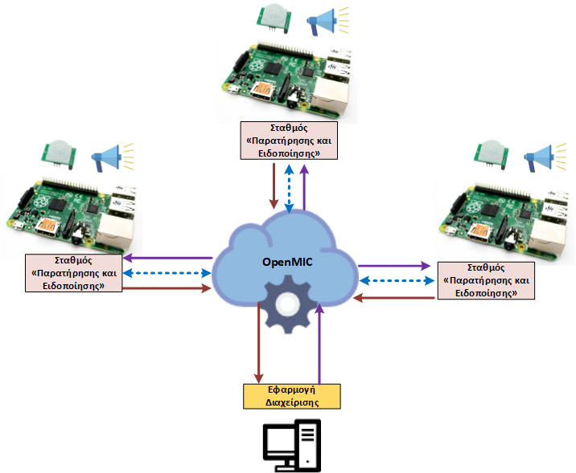
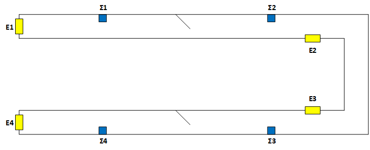
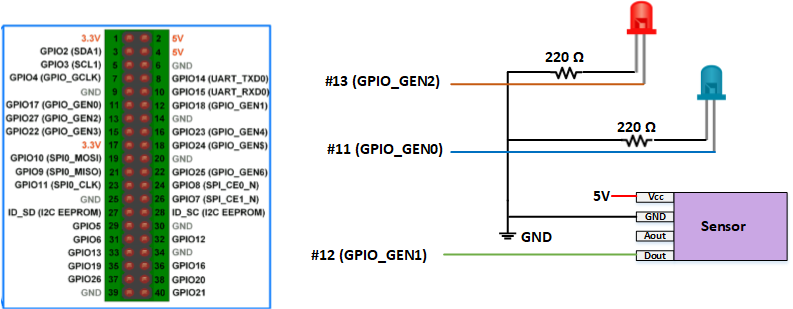
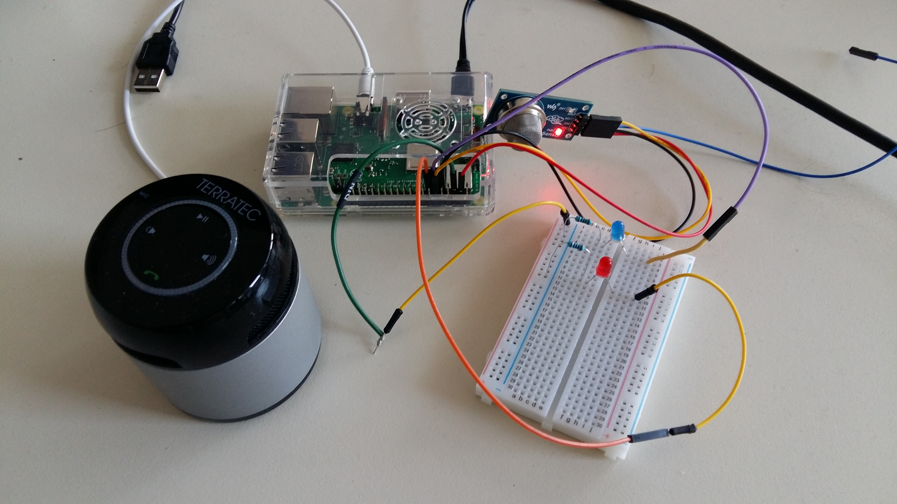
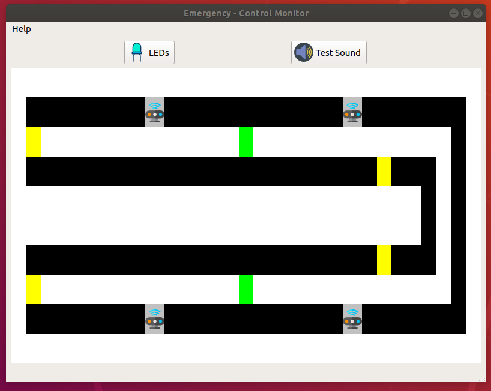

# Σύστημα ασφαλής εκκένωσης κτιρίων

## Περιγραφή
Σχεδιάσαμε και υλοποιήσαμε ένα ευφυές σύστημα που βοηθά στην ασφαλή εκκένωση κτιρίων (π.χ. σχολεία, δημόσιες υπηρεσίες) σε περίπτωση έκτακτης ανάγκης όπως πυρκαγιές, σεισμοί κλπ.  Ένα σημαντικό σημείο διαφοροποίησης της συγκεκριμένης πρότασης σε σχέση με άλλα παρόμοια συστήματα είναι η υποστήριξη της δυνατότητας συνεργασίας μεταξύ των επιμέρους σταθμών «παρατήρησης και ειδοποίησης» καθώς και της απομακρυσμένης διαχείρισης τους. 

Η συνεργασία επιτρέπει στους σταθμούς να ενημερώνονται άμεσα και αυτοματοποιημένα για συγκεκριμένα γεγονότα από κάποιον άλλο σταθμό, με συνέπεια να προσαρμόζουν κατάλληλα τις οδηγίες που παρέχουν προς τους πολίτες ώστε να ταιριάζουν πάντα με τις συγκεκριμένες συνθήκες που επικρατούν. 

Γενικότερα, το σύστημα αποτελείται από ένα κέντρο ελέγχου και μια σειρά από επιμέρους σταθμούς «παρατήρησης και ειδοποίησης» που βρίσκονται τοποθετημένοι σε συγκεκριμένα σημεία σε κάποιο  κτίριο. Μια γενική περιγραφή παρουσιάζεται στο παρακάτω σχήμα.



Κάθε σταθμός βασίζεται αποκλειστικά σε ανοιχτό υλικό και περιλαμβάνει: 
* ένα Raspberry Pi 3 
* ένα αισθητήρα εντοπισμού φωτιάς ή ένα αισθητήρα εντοπισμού αερίων
* ένα μπλε LED, που αναβοσβήνει και αντιστοιχεί στην περίπτωση που δεν υπάρχει οποιοδήποτε έκτακτο γεγονός 
* ένα κόκκινο LED, που αναβοσβήνει όταν έχει εντοπιστεί κάποιο έκτακτο γεγονός (είτε από τον ίδιο τον σταθμό είτε από κάποιον άλλον) και αντιστοιχεί στην περίπτωση που ο σταθμός παίζει κάποιο μήνυμα εκκένωσης
* ένα φορητό ηχείο, για την αναπαραγωγή των ηχογραφημένων μηνυμάτων

Επίσης, σε κάθε σταθμό τρέχει μια εφαρμογή Python (διαθέσιμη στο φάκελο <b><i>/examples/emergency/station/</i></b>) που ελέγχει τους αισθητήρες και τα διαθέσιμα LEDs μέσω των GPIO pins που υποστηρίζει το Raspberry Pi και την βοήθεια της ανοιχτής βιβλιοθήκης <b><i>RPi.GPIO</i></b>, ενώ μέσω της βιβλιοθήκης <b><i>OpenMIC</i></b> που έχουμε αναπτύξει μπορεί εύκολα και άμεσα να λαμβάνει μηνύματα από το κέντρο ελέγχου, να στέλνει μηνύματα στο κέντρο ελέγχου και να συνεργάζεται με τους άλλους σταθμούς.  Τέλος, μπορεί να αναπαράγει το κατάλληλο ηχητικό μήνυμα μέσω της ανοιχτής βιβλιοθήκης <b><i>Pygame</i></b>.

Οι ενέργειες που εκτελεί ο κάθε σταθμός «παρατήρησης και ειδοποίησης» εξαρτώνται από τα μηνύματα και τις πληροφορίες που λαμβάνει από το κέντρο ελέγχου, τους αισθητήρες και τους άλλους σταθμούς:
* Αλληλεπίδραση με το κέντρο ελέγχου:
	* <b>Ηχητικός έλεγχος</b>: Κάθε σταθμός που λαμβάνει το αντίστοιχο μήνυμα αναπαράγει ένα σύντομο κουδούνισμα, λειτουργεί ως ένας απλός τρόπος     ελέγχου ότι ο σταθμός έχει επικοινωνία με το κέντρο ελέγχου.
	* <b>Αλλαγή ρυθμού LEDs</b>: Κάθε σταθμός που λαμβάνει το αντίστοιχο μήνυμα εναλλάσσει το ρυθμό που αναβοσβήνουν τα διαθέσιμα LEDs μεταξύ των δύο προκαθορισμένων τύπων (αργά ή γρήγορα).
* Αλληλεπίδραση με τους αισθητήρες: Κάθε δευτερόλεπτο ελέγχουμε την κατάσταση των αισθητήρων μέσω των GPIO pins. Αν κάποιος αισθητήρας εντοπίσει πρόβλημα (φωτιά, αέριο κ.λπ.) τότε αμέσως στο συγκεκριμένο σταθμό εκτελούνται αυτόματα τα παρακάτω βήματα:
	* Στέλνεται ένα μήνυμα στο κέντρο ελέγχου για να ενημερωθεί για το πρόβλημα και το σταθμό που το εντόπισε ώστε να ακουστεί η σειρήνα από το κέντρο ελέγχου.
	* Σταματάει να αναβοσβήνει το μπλε LED και αρχίζει το κόκκινο.
	* Ο σταθμός αρχίζει να αναπαράγει συνεχώς το κατάλληλο ηχογραφημένο μήνυμα με τις οδηγίες εκκένωσης.
	* Στέλνεται ένα μήνυμα ενημέρωσης σε όλους τους άλλους σταθμούς, για να γνωρίζουν ότι έχει εντοπιστεί κάποιο έκτακτο γεγονός και από ποιον ακριβώς σταθμό.
* Αλληλεπίδραση με τους άλλους σταθμούς: Μόλις ένας σταθμός λάβει κάποιο μήνυμα από άλλον τότε οι ενέργειες που θα εκτελέσει εξαρτώνται από το αν βρίσκεται σε κατάσταση κανονικής λειτουργίας ή έκτακτης ανάγκης. 
	* <b>Κανονική λειτουργία </b>: Σταματάει να αναβοσβήνει το μπλε LED και αρχίζει το κόκκινο και αρχίζει να αναπαράγει συνεχώς το  
	  κατάλληλο ηχογραφημένο μήνυμα με τις οδηγίες εκκένωσης.
	* <b>Έκτακτη ανάγκη </b>: Ελέγχει αν πρέπει να αλλάξει το μήνυμα με τις οδηγίες εκκένωσης που ήδη αναπαράγει ώστε να ταιριάζει με την 
	  νέα κατάσταση. 	

Επιπλέον, υπάρχει ένα κέντρο ελέγχου που συντονίζει την  συνολική λειτουργία του συστήματος.   Η εφαρμογή του κέντρου ελέγχου (διαθέσιμη στο φάκελο <b><i>/examples/emergency/control_monitor/</i></b>) μπορεί να εγκατασταθεί είτε σε κάποιο προσωπικό υπολογιστή είτε σε κάποιο Raspberry Pi και παρέχει μια απλή γραφική διεπαφή για την αλληλεπίδραση με τους σταθμούς «παρατήρησης και ειδοποίησης» την απεικόνιση των θέσεων των σταθμών και την παρακολούθηση των μηνυμάτων τους. Η υλοποίηση του κέντρο ελέγχου βασίζεται στο ελεύθερο λογισμικό PyQt5 που επιτρέπει μεταξύ άλλων την δημιουργία πλήρως λειτουργικών γραφικών διεπαφών.

Στη συνέχεια παρουσιάζουμε τον σχεδιασμό και την υλοποίηση της δυνατότητας των σταθμών «παρατήρησης και ειδοποίησης» να αποφασίζουν ποιο είναι το κατάλληλο ηχητικό μήνυμα που πρέπει να αναπαράγουν ανάλογα με την θέση τους, το έκτακτο γεγονός που έχει εντοπιστεί και την κατάσταση των άλλων σταθμών.

Θεωρούμε πως σε κάθε κτίριο υπάρχει ένας συγκεκριμένος αριθμός από σταθμούς που βρίσκονται τοποθετημένοι σε συγκεκριμένα σημεία, ενώ παράλληλα υπάρχουν δεδομένες έξοδοι κινδύνου καθώς και προκαθορισμένα σημεία συγκέντρωσης.  Για την υλοποίηση της εφαρμογή μας έχουμε θεωρήσει ένα κτίριο που σχηματίζει ένα Π στο οποίο έχουμε εγκαταστήσει 4 σταθμούς «παρατήρησης και ειδοποίησης» και παράλληλα υπάρχουν 4 έξοδοι κινδύνου μέσω των οποίων πρέπει να γίνεται η εκκένωση. Το παρακάτω σχήμα παρουσιάζει το κτίριο, τις θέσεις των σταθμών (μπλε τετράγωνα) και τις εξόδους κινδύνου (κίτρινα ορθογώνια) που βρίσκονται κοντά σε κάθε σταθμό παρατήρησης. 



Με βάση την παραπάνω περιγραφή, κάθε σταθμός «παρατήρησης και ειδοποίησης» διατηρεί ένα τοπικό πίνακα συσχέτισης γεγονότων με βάση τον οποίο αποφασίζει ποιο ηχητικό μήνυμα πρέπει να χρησιμοποιηθεί. Πρόκειται για ένα πίνακα 4x4 (στη γενική περίπτωση ο αριθμός των γραμμών αντιστοιχεί στο πλήθος των σταθμών και ο αριθμός των στηλών στο πλήθος των εξόδων κινδύνου), με την τιμή σε κάθε θέση του πίνακα να είναι 0 ή 1. Κάθε σταθμός γνωρίζει τη σχετική του θέση οπότε χρησιμοποιεί την αντίστοιχη γραμμή του πίνακα και αναζητά αν υπάρχει σε κάποια στήλη η τιμή 1 για να μεταδώσει το αντίστοιχο μήνυμα. Αν δεν βρει , σημαίνει ότι έχουν μπλοκαριστεί όλες οι κοντινές έξοδοι οπότε μεταδίδει ένα προκαθορισμένο μήνυμα που συνιστά την μετάβαση σε κοντινά παράθυρα και πως φτάνει σύντομα εξωτερική βοήθεια. Τέλος, κάθε σταθμός ανανεώνει τον πίνακα (αλλάζει τα αντίστοιχα 1 σε 0 ) μόλις εντοπίσει ο ίδιος κάποιο έκτακτο γεγονός ή μόλις  ενημερωθεί από κάποιον άλλο.

Για την δημιουργία των ηχητικών μηνυμάτων κάναμε χρήση της δωρεάν online υπηρεσίας text2speech (https://www.text2speech.org) που επιτρέπει την αυτόματη μετατροπή κειμένου σε αρχεία ήχου.

Για την υλοποίηση του συστήματος ακολουθήσαμε τα παρακάτω βήματα:
1.	Σχεδιασμός συνολικού συστήματος και καταγραφή των απαιτήσεων.
2.	Δημιουργία κυκλώματος και έλεγχος μέσω του Raspberry Pi.  
3.	Υλοποίηση εφαρμογής σταθμού παρατήρησης με ενσωμάτωση της λογικής ελέγχου του κυκλώματος και δυνατότητα αναπαραγωγής αρχείου ήχου.
4.	Υλοποίηση του κέντρου ελέγχου, αρχικά ως ένα απλό πρόγραμμα χωρίς γραφική διεπαφή που μπορούσε όμως να επικοινωνεί με τους σταθμούς και να ανταλλάσσει μηνύματα
5.	Επέκταση λογικής σταθμού παρατήρησης ώστε να επικοινωνεί με το κέντρο ελέγχου και με τους άλλους σταθμούς.
6.	Επέκταση λογικής σταθμού παρατήρησης ώστε να αποφασίζει για το ηχητικό μήνυμα που θα αναπαραχθεί ανάλογα με την κατάσταση τόσο του ίδιου του σταθμού  όσο και των άλλων.
7.	Υλοποίηση της γραφικής διεπαφής του κέντρου ελέγχου.
8.	Τέλος, εκτέλεση δοκιμών και αλλαγές μέχρι το σύστημα να λειτουργεί χωρίς κανένα πρόβλημα. 

Ο παρακάτω πίνακας παρουσιάζει το απαραίτητο υλικό και το αντίστοιχο κόστος για ένα σταθμό «παρατήρησης και ειδοποίησης».

Υλικά         | Κόστος
------------- | -------------
1 x  Raspberry Pi 3  | 	35 €
1 x Αισθητήρα αερίου (Waveshare MQ-5 Gas Sensor Module)	 |  6 €
1 x Αισθητήρα φωτιάς (Waveshare Flame Sensor)	| 3.5 €
2 x LEDs	| 0.2 €
2 x Αντιστάσεις 220 Ω	| 0.1 €
Ένα απλό ηχείο | 3 €
Μερικά καλώδια για τις συνδέσεις | -

Tέλος, το συγκεκριμένο σενάριο επιλέχθηκε για καθαρά πρακτικούς λόγους που έχουν να κάνουν με τον αριθμό των Raspberry Pi που είχαμε στη διάθεσή μας. Μπορούμε να χρησιμοποιήσουμε το σύστημα με λιγότερους σταθμούς χωρίς καμία απολύτως αλλαγή.  Παράλληλα, το σύστημα έχει σχεδιαστεί ώστε εύκολα να μπορεί να επεκταθεί με την προσθήκη επιπλέον αισθητήρων καθώς και την προσθήκη επιπλέον σταθμών με πολύ απλές αλλαγές σε συγκεκριμένα σημεία των εφαρμογών: 
* <b><i>Κέντρο ελέγχου</i></b>: Αρκεί να τροποποιηθεί κατάλληλα το αρχείο <b><i>map.json</b></i> που περιέχει την περιγραφή της γραφικής απεικόνισης του σεναρίου και η λίστα <b><i>COLORS</b></i> στην εφαρμογή του κέντρου ελέγχου. Δεν απαιτούνται άλλες αλλαγές.
* <b><i>Σταθμός «παρατήρησης και ειδοποίησης»</i></b>: Θα πρέπει να ανανεωθεί κατάλληλα ο τοπικός πίνακας συσχέτισης των γεγονότων (μεταβλητή <i>lookup_table</i>) που πρέπει να έχει πάντα διάσταση <i>Ν x M</i>, όπου <i>Ν</i> είναι το πλήθος των σταθμών παρατήρησης και <i>Μ</i> το πλήθος απο τις εξόδους κινδύνου. Επιπλέον, θα πρέπει να προσθέσουμε στον φάκελο sounds τα wav αρχεία  με τις ηχητικές οδηγίες για τους νέους σταθμούς,  ακολουθώντας την σύμβαση στην ονομασία <i>"evacuation_NUMBER.wav”</i>. Τέλος, αν θέλουμε να προσθέσουμε επιπλέον αισθητήρες σε κάθε σταθμό αρκεί να κάνουμε τις σχετικές αλλαγές στο αρχείο <i>MonitoringStation.py</i> και πιο συγκεκριμένες στις μέθοδους <i>_ _init__ , start , collaboration.</i> 

## Εγκατάσταση

Για την χρήση του συστήματος θα πρέπει υποχρεωτικά να έχει προηγηθεί η εγκατάσταση της βιβλιοθήκης OpenMIC τόσο στο μηχάνημα που θα φιλοξενεί το κέντρο ελέγχου όσο και σε όλα τα Raspberry Pi.  Αναλυτικές πληροφορίες για την εγκατάσταση της βιβλιοθήκης υπάρχουν στο  [σύνδεσμο](openmic.md).

Στη συνέχεια θα πρέπει να εγκατασταθούν σε όλες τις συσκευές οι αναγκαίες βιβλιοθήκες (PyQt5 και pygame):
```
# sudo apt-get install python3-pyqt5
# sudo pip3 install pygame
```

Επιπλέον, θα πρέπει να υπάρχει σύνδεση μεταξύ του κέντρου ελέγχου και των σταθμών εργασίας ώστε να μπορούν να ανταλλάσσουν τα απαραίτητα μηνύματα. Έτσι, θα πρέπει να ρυθμιστούν κατάλληλα οι παράμετροι επικοινωνίας στην εφαρμογή του κέντρου ελέγχου (<i>αρχείο ControlMonitor.py , μέθοδος setup_openmic_controller()</i> )  και των σταθμών (<i> αρχείο MonitoringStation.py , μέθοδος _ _init_ _() </i>). Περισσότερες πληροφορίες για τις παραμέτρους σύνδεσης υπάρχουν στην σελίδα περιγραφής της βιβλιοθήκης [OpenMIC](openmic.md).

Γενικότερα, το σύστημα αντιστοιχεί στην περίπτωση που η βιβλιοθήκη OpenMIC μας παρέχει τη δυνατότητα τόσο για κεντρικό έλεγχο πολλαπλών Raspberry Pi συσκευών όσο και τη δυνατότητα συνεργασίας μεταξύ τους μέσω της άμεσης ανταλλαγής μηνυμάτων.

Στη συνέχεια θα πρέπει σε κάθε σταθμό «παρατήρησης και ειδοποίησης» να συνδεθούν οι αισθητήρες και τα LEDs στα προκαθορισμένα GPIO pins με τα οποία έχει προγραμματιστεί η εφαρμογή. Στο σχήμα που ακολουθεί παρουσιάζουμε το κύκλωμα και τις απαραίτητες συνδέσεις. Τέλος, θα πρέπει να συνδέσουμε ένα εξωτερικό φορητό ηχείο στο Raspberry Pi στην αντίστοιχη είσοδο (είναι σημαντικό να βεβαιωθούμε δεν έχουμε κλείσει τον ήχο απο το Raspbian).

 

Έχοντας ολοκληρώσει τα παραπάνω βήματα θα έχουμε πλέον ένα ολοκληρωμένο σταθμό «παρατήρησης και ειδοποίησης» όπως φαίνεται στην παρακάτω εικόνα.

 

Σε αντίθεση με την βιβλιοθήκη OpenMIC που υπάρχει η δυνατότητα κεντρικής  εγκατάστασης σε κάποιο υπολογιστή μέσω της εκτέλεσης της αντίστοιχης εντολής,  για την περίπτωση του συστήματος ασφαλής εκκένωσης κτιρίων απλά πηγαίνουμε στους αντίστοιχους φακέλους και εκτελούμε τις εφαρμογές. Αν θέλουμε να μεταφέρουμε τα αρχεία σε διαφορετική θέση από εκείνη που έγιναν clone απο το github, θα πρέπει η μεταφορά να περιλαμβάνει το πλήρες περιεχόμενο του κάθε υπο-φακέλου (<i>/examples/emergency/station/   &  /examples/emergency/control_monitor/</i>) και όχι μόνο το κεντρικό αρχείο κάθε εφαρμογής (<i> ControlMonitor.py & MonitoringStation.py </i>).

Για την έναρξη της εκτέλεσης του κέντρου ελέγχου αφού είμαστε στον αντίστοιχο φάκελο (examples/emergency/control_monitor/) εκτελούμε απλά την εντολή:
```
# python3 ControlMonitor.py
```

Για την εκτέλεση του σταθμού «παρατήρησης και ειδοποίησης» αφού είμαστε στον αντίστοιχο φάκελο (examples/emergency/station/) εκτελούμε την εντολή με το κατάλληλα όρισμα (0 ή 1 ή 2 ή 3) για να προσδιορίσουμε ποιος συγκεκριμένες σταθμός είναι. 
```
# python3 MonitoringStation.py  [0|1|2|3]
```

<i>Σημείωση</i>: Θα πρέπει για κάθε σταθμό να προσδιορίζουμε διαφορετικό όρισμα για να μπορεί το σενάριο να εκτελείται σωστά και να ακούμε τα κατάλληλα ηχητικά μηνύματα. Αν εκτελούμε το σενάριο με λιγότερους σταθμούς πάλι σημαντικό είναι να διαλέγουμε διαφορετικά ορίσματα και όχι τόσο ποια θα επιλέξουμε.

## Λειτουργία

Έχοντας ακολουθήσει τις οδηγίες που περιγράφονται στην ενότητα εγκατάστασης θα πρέπει πλέον να υπάρχει  σε κάποιον υπολογιστή ή Raspberry Pi εγκατεστημένη, ρυθμισμένη και να τρέχει η εφαρμογή για το κέντρο ελέγχου και στα τέσσερα απαιτούμενα Raspberry Pi η εφαρμογή  που αντιστοιχεί στο σταθμό «παρατήρησης και ειδοποίησης» καθώς και τα σχετικά κυκλώματα.

Μετά από ελάχιστα δευτερόλεπτα όλοι οι σταθμοί θα έχουν επικοινωνήσει με το κέντρο ελέγχου και η γραφική διεπαφή του κέντρο ελέγχου θα πρέπει να είναι όπως η παρακάτω εικόνα.

 

Πλέον, μπορούμε να δοκιμάσουμε την εφαρμογή.  Αν επιλέξουμε το κουμπί το ηχητικού ελέγχου τότε θα πρέπει να ακούσουμε από όλους τους σταθμούς παρατήρησης ένα σύντομο κουδούνισμα.  Αν επιλέξουμε το κουμπί για τα LEDs τότε θα δούμε να αλλάζει μεταξύ των δύο προκαθορισμένων τιμών ο ρυθμός με τον οποίο αναβοσβήνει το μπλε LED σε κάθε σταθμό. 

Τέλος, μπορούμε με την χρήση ενός αναπτήρα να προκαλέσουμε κάποιο έκτακτο γεγονός σε οποιονδήποτε σταθμό. Για τους σταθμούς με τον αισθητήρα φωτιάς αρκεί να πληρισάσουμε την φλόγα του αναπτήρα σχετικά κοντά στον αισθητήρα για ένα σύντομο χρονικό διάστημα. Για τους σταθμούς με τον αισθητήρα αερίων αρκεί να απελευθερέσουμε λίγο αέριο απο τον αναπτήρα (χωρίς να είναι αναμμένος) σχετικά κοντά στον αισθητήρα για ένα σύντομο χρονικό διάστημα. Αμέσως, ο συγκεκριμένος σταθμός θα αρχίσει να εκπέμπει το κατάλληλο ηχογραφημένο μήνυμα και θα ενημερώσει το κέντρο ελέγχου και όλους τους άλλους σταθμούς για το γεγονός. Επίσης, τοπικά σταματάει να αναβοσβήνει το μπλε LED και αρχίζει το κόκκινο. 

Μετά από ελάχιστο χρόνο το μήνυμα θα φτάσει στο κέντρο ελέγχου και θα ακουστεί μια μικρή σειρήνα ενώ στη γραφική διεπαφή ο διαχειριστής μπορεί να δει πιο συγκεκριμένος σταθμός έστειλε το μήνυμα, άρα να γνωρίζει που είναι το πρόβλημα ώστε να κάνει τις κατάλληλες ενέργειες. Ταυτόχρονα το μήνυμα θα φτάσει σε όλους τους σταθμούς που με βάση τη θέση τους και τη θέση του προβλήματος θα αρχίσουν να μεταδίδουν συνεχώς το κατάλληλο ηχογραφημένο μήνυμα. Οι σταθμοί κάθε φορά που λαμβάνουν ένα μήνυμα για έκτακτο γεγονός από κάποιο άλλο σταθμό πάντα ελέγχουν ποιες είναι οι σωστές οδηγίες διαφυγής και ακόμη και αν μεταδίδουν ήδη κάποια αν χρειαστεί τότε την ανανεώνουν με τις κατάλληλες οδηγίες.

Τα διάφορα σενάρια που υποστηρίζονται και τα αναμενόμενα ηχητικά μηνύματα συνοψίζονται στον παρακάτω πίνακα.


Για να εκτελέσουμε κάποιο διαφορετικό σενάριο έκτακτου γεγονότος θα πρέπει να κλείσουμε τόσο την εφαρμογή του κέντρο ελέγχου όσο και τις εφαρμογές στους τέσσερις σταθμούς παρατήρησης και στη συνέχεια να επιλέξουμε εκ νέο την εκτέλεσή τους.

Μια ολοκληρωμένη επίδειξη της συνολικής λειτουργίας του συστήματος υπάρχει στο παρακάτω video:  <mark> VIDEO LINK</mark>

