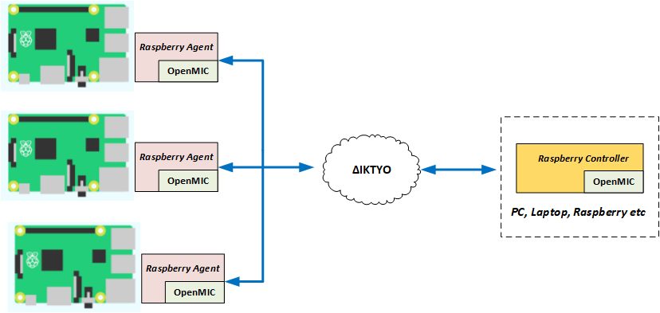
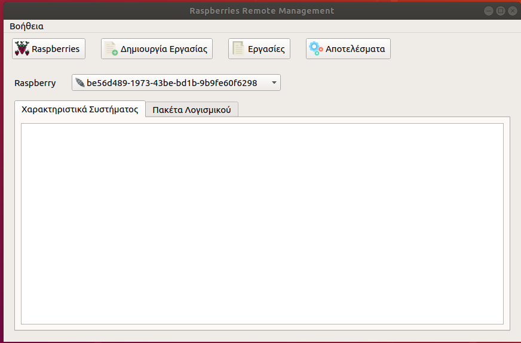
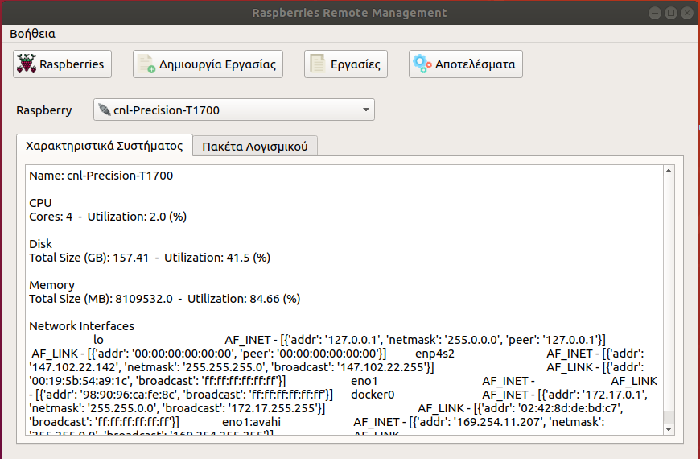
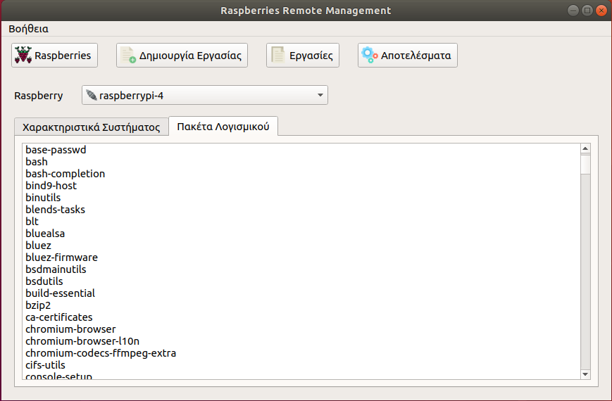
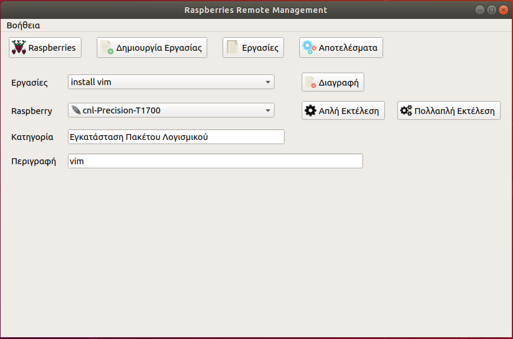
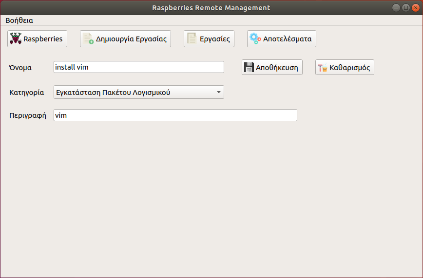
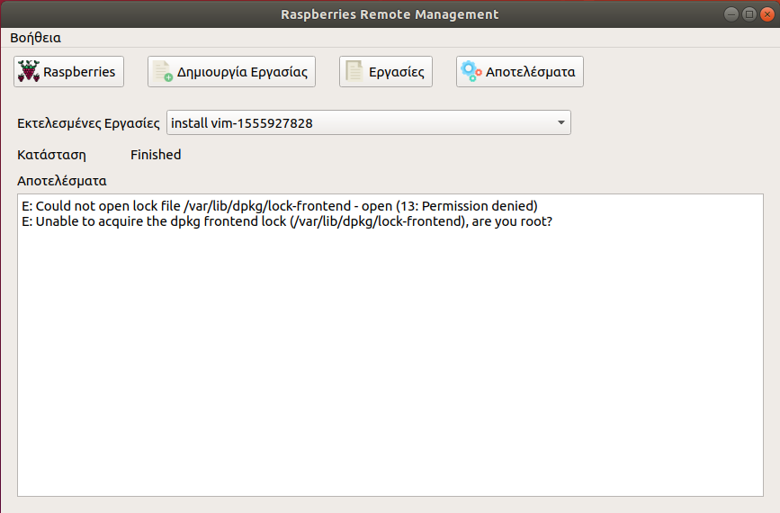
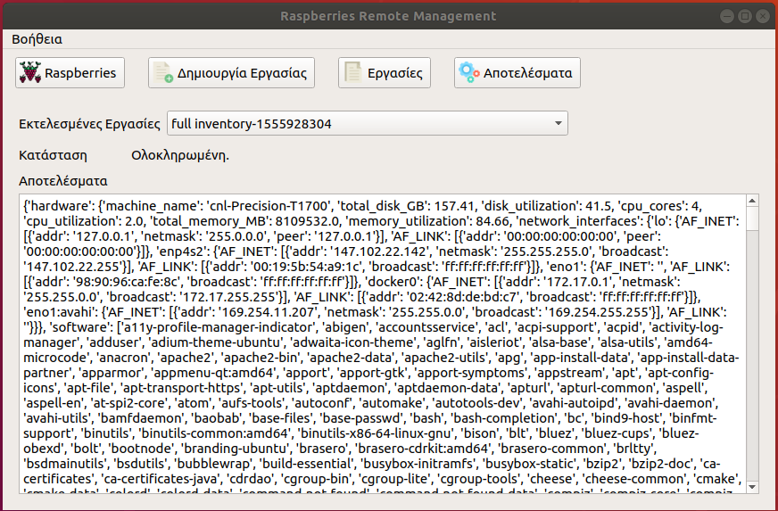

# Σύστημα απομακρυσμένης διαχείρισης πολλαπλών συσκευών Raspberry Pi 

## Περιγραφή
Το σύστημα απομακρυσμένης διαχείρισης πολλαπλών συσκευών Raspberry Pi,  με λειτουργικό σύστημα Raspbian, βασίζεται στις δυνατότητες και τις διευκολύνσεις που παρέχει η βιβλιοθήκη OpenMIC για την ανάπτυξη συστημάτων που εκτελούνται σε πολλαπλά μηχανήματα. Μάλιστα, αντιστοιχεί στην περίπτωση που η βιβλιοθήκη μας εξασφαλίζει μόνο τον κεντρικό έλεγχο πολλαπλών εφαρμογών αφού σε αντίθεση με το σύστημα ασφαλής εκκένωσης κτιρίων σε αυτή την περίπτωση οι εφαρμογές που βρίσκονται στις διάφορες συσκευές δεν ανταλλάσσουν μηνύματα συνεργασίας.

Το σύστημα περιλαμβάνει μια εφαρμογή (Raspberry Controller) που είναι υπεύθυνη για την διαχείριση και τον κεντρικό έλεγχο  των συσκευών. Επιπλέον, σε κάθε συσκευή  Raspberry Pi που θέλουμε να διαχειριστούμε πρέπει να βρίσκεται εγκατεστημένη μια άλλη εφαρμογή (Raspberry Agent) που δέχεται τις εντολές από την εφαρμογή διαχείρισης (Raspberry Controller), τις εκτελεί και την ενημερώνει με τα αποτελέσματα.  Πρακτικά, η εφαρμογή που υπάρχει σε κάθε συσκευή λειτουργεί ως συνδετικός κρίκος μεταξύ της συσκευής και της κεντρικής εφαρμογής διαχείρισης. Μπορούμε να την φανταστούμε ως έναν αυτοματοποιημένο τοπικό μας αντιπρόσωπο που εκτελεί τις εντολές που του στέλνουμε και μας αναφέρει τα αποτελέσματα τους. Επίσης, είναι ρυθμισμένος να μας στέλνει περιοδικά ένα απλό μήνυμα κατάστασης ώστε να γνωρίζουμε ότι δεν υπάρχει κάποιο πρόβλημα. Η συγκεκριμένη λειτουργικότητα είναι αυτομάτως διαθέσιμη σε κάθε εφαρμογή που βασίζεται στην βιβλιοθήκη OpenMIC.



Μέσω της γραφικής διεπαφής της εφαρμογής διαχείρισης οι χρήστες μπορούν να στέλνουν διάφορες εντολές σε όλες ή σε επιμέρους συσκευές και να λαμβάνουν αυτόματα τα σχετικά αποτελέσματα. Η εφαρμογή υποστηρίζει τις παρακάτω κατηγορίες εντολών:
* Καταγραφή χαρακτηριστικών συστήματος.
* Καταγραφή εγκατεστημένων πακέτων λογισμικού
* Γενικές εντολές.
* Εντολές συστήματος.
* Εγκατάσταση πακέτου λογισμικού
* Απεγκατάσταση πακέτου λογισμικού 

Για την περιγραφή των εντολών μεταξύ controller – agent έχουμε ορίσει μια κοινή σύνταξη που βασίζεται στη χρήση δυο βασικών πεδίων/παραμέτρων. Η πρώτη παράμετρος (με όνομα <i>“cmd”</i>) περιγράφει το είδος της εντολής ενώ η δεύτερη παράμετρος (με όνομα <i>“params”</i>) περιέχει τις πιθανές παραμέτρους της εντολής. Ο πίνακας που ακολουθεί συνοψίζει την περιγραφή όλων των εργασιών που υποστηρίζει το σύστημα που έχουμε υλοποιήσει.

Κατηγορία Εντολής | Περιγραφή | Παράδειγμα
------------------|-----------|-------------
Καταγραφή χαρακτηριστικών συστήματος| <i> { “cmd”: “inventory”, “params”: “0” } </i>  | Η εντολή έχει πάντα την συγκεκριμένη περιγραφή.
Καταγραφή εγκατεστημένων πακέτων λογισμικού| <i>{ “cmd”: “inventory”, “params”: “1” } </i> | Η εντολή έχει πάντα την συγκεκριμένη περιγραφή.
Συνδυασμένη καταγραφή χαρακτηριστικών συστήματος και εγκατεστημένων πακέτων λογισμικού| <i>{ “cmd”: “inventory”, “params”: “2” } </i> | Η εντολή έχει πάντα την συγκεκριμένη περιγραφή.
Γενικές εντολές|<i>{ “cmd”: “simple_command”, “params”: “COMMAND DESCRIPTION” } </i> |Άνοιγμα browser στην σελίδα του διαγωνισμού { “cmd”: “simple_command”, “params”: “chromium-browser https://robotics.ellak.gr” }
Εντολές συστήματος| <i>{ “cmd”: “shell_command”, “params”: “COMMAND_DESCRIPTION” } </i> |Εμφάνιση πληροφοριών σχετικά με τη χρήση της μνήμης σε MBs { “cmd”: “shell_command”, “params”: “free -m” }
Εγκατάσταση πακέτου λογισμικού| <i>{ “cmd”: “install_package”, “params”: “PACKAGE NAME” } </i> |Εγκατάσταση πακέτου “vim”  {  “cmd”: “install_package”, “params”: “vim” }
Απεγκατάσταση πακέτου λογισμικού |  <i>{ “cmd”: “uninstall_package”, “params”: “PACKAGE NAME” } </i> |Απεγκατάσταση πακέτου “vim” { “cmd”: “uninstall_package”, “params”: “vim” }

Τέλος, το σύστημα δεν διαθέτει κάποιο μηχανισμό για να αποθηκεύει μόνιμα τις πληροφορίες σχετικά με τις συσκευές Raspberry Pi, τις εργασίες που έχουμε δημιουργήσει και τα αποτελέσματα εκτέλεσής τους. Έτσι, κάθε φορά που κλείνουμε την εφαρμογή διαχείρισης χάνουμε και τις αντίστοιχες πληροφορίες. Μια μελλοντική επέκταση θα μπορούσε να ενσωματώσει ένα τέτοιο μηχανισμό. 

## Εγκατάσταση

Αρχικά θα πρέπει όλες οι συσκευές Raspberry Pi που θέλουμε να διαχειριστούμε να βασίζονται στο λειτουργικό σύστημα Raspbian, καθώς με βάση αυτό έχει γίνει η ανάπτυξη και ο έλεγχος του συστήματος. 

Για την χρήση του συστήματος θα πρέπει υποχρεωτικά να έχει προηγηθεί η εγκατάσταση της βιβλιοθήκης OpenMIC τόσο στο μηχάνημα που θα φιλοξενεί το κέντρο ελέγχου όσο και σε όλα τα Raspberry Pi.  Αναλυτικές πληροφορίες για την εγκατάσταση της βιβλιοθήκης υπάρχουν στο [σύνδεσμο](openmic.md).

Στη συνέχεια θα πρέπει σε όλα τα μηχανήματα Raspberry Pi που θέλουμε να διαχειριστούμε να εγκατασταθεί επιπλέον η βιβλιοθήκη netifaces.
```
# sudo pip3 install netifaces
```
Ακόμη θα πρέπει να δημιουργήσουμε τον παρακάτω φάκελο <i>/home/root</i> για να μπορεί η εφαρμογή να αποθηκεύει κάποιες απαραίτητες βοηθητικές πληφορορίες όταν την εκτελούμε με πλήρη δικαιώματα. Πιο συγκεκριμένα εκτελούμε απλά την εντολή
```
# sudo mkdir /home/root
```

Ενώ στο μηχάνημα που φιλοξενεί την εφαρμογή διαχείρισης θα πρέπει να εγκατασταθεί η βιβλιοθήκη PyQt5.
```
# sudo apt-get install python3-pyqt5
```

Επιπλέον, θα πρέπει να υπάρχει σύνδεση μεταξύ του μηχανήματος που φιλοξενεί την εφαρμογή διαχείρισης και των σταθμών εργασίας που θέλουμε να διαχειριστούμε ώστε να μπορούν να ανταλλάσσουν τα απαραίτητα μηνύματα. Έτσι, θα πρέπει να ρυθμιστούν κατάλληλα οι παράμετροι επικοινωνίας στην εφαρμογή διαχείρισης (<i>αρχείο RaspberryController.py , μέθοδος setup_openmic_controller()</i> )  και των σταθμών (<i>αρχείο RaspberryAgent.py , μέθοδος _ _init_ _()</i> ).  Περισσότερες πληροφορίες για τις παραμέτρους σύνδεσης υπάρχουν στην σελίδα περιγραφής της βιβλιοθήκης [OpenMIC](openmic.md).

Γενικότερα, το σύστημα αντιστοιχεί στην περίπτωση που η βιβλιοθήκη OpenMIC μας παρέχει τη δυνατότητα για κεντρικό έλεγχο πολλαπλών Raspberry Pi συσκευών, καθώς σε αυτό το σενάριο χρήσης δεν υπάρχει συνεργασία μεταξύ των σταθμών.
Πλέον, είμαστε έτοιμοι να χρησιμοποιήσουμε το σύστημα. Αν θέλουμε να μεταφέρουμε σε διαφορετική θέση από εκείνη που έγιναν clone θα πρέπει η μεταφορά να περιλαμβάνει το πλήρες περιεχόμενο του κάθε υπο-φακέλου (<i>/examples/management/agent/   &  /examples/management/controller/ </i>) και όχι μόνο το βασικό αρχείο κάθε εφαρμογής ( <i>RaspberryController.py & RaspberryAgent.py </i> ).

Για την έναρξη της εκτέλεσης της εφαρμογής διαχείρισης αφού είμαστε στον αντίστοιχο φάκελο εκτελούμε απλά την εντολή:
```
# python3 RaspberryController.py
```

Για την εκτέλεση της εφαρμογής παρακολούθησης ενός Raspberry Pi αφού είμαστε στον αντίστοιχο φάκελο εκτελούμε απλά την εντολή: 
```
# sudo python3 RaspberryAgent.py 
```

Η εφαρμογή RaspberryAgent πρέπει να εκτελείται με πλήρη δικαιώματα χρήστη αν θέλουμε να εκτελείται σωστά η εγκατάσταση και απεγκατάσταση πακέτων και όλες οι πιθανές εντολές. Στην περίπτωση που εκτελούμε την εφαρμογή παρακολούθησης ενός Raspberry Pi χωρίς πλήρη δικαιώματα το σύστημα θα λειτουργεί απλά δεν θα ολοκληρώνονται σωστά οι αντίστοιχες εργασίες.

## Λειτουργία

Έχοντας ακολουθήσει τις οδηγίες που περιγράφονται στην ενότητα εγκατάστασης θα πρέπει πλέον να υπάρχει  σε κάποιον υπολογιστή ή Raspberry Pi εγκατεστημένη, ρυθμισμένη και να τρέχει η εφαρμογή διαχείρισης και σε κάθε Raspberry Pi η αντίστοιχη εφαρμογή.
Στη συνέχεια παρουσιάζουμε την γραφική διεπαφή της εφαρμογής διαχείρισης, που περιλαμβάνει 4 βασικές ενότητες (διαθέσιμα Raspberry Pi, ορισμός εργασίας, διαθέσιμες προς εκτέλεση εργασίες και αποτέλεσματα), που αντιστοιχούν στα 4 βασικά κουμπία. 


 
Κάθε φορά που ενεργοποιούμε την εφαρμογή σε κάποιο Raspberry Pi μετά από λίγο αυτόματα η εφαρμογή διαχείρισης αναγνωρίζει την νέα συσκευή και την προσθέτει στη λίστα με τις διαθέσιμες προς διαχείριση συσκευές στην αντίστοιχη ενότητα της γραφικής διεπαφής. Αντίστοιχα, αν σταματήσουμε την εφαρμογή σε κάποια συσκευή Raspberry Pi, μετά από περίπου 3 λεπτά το σύστημα αφού δεν θα έχει λάβει κανένα απολύτως μήνυμα κατάστασης από την συσκευή θα ανιχνεύσει ότι δεν είναι πλέον διαθέσιμη προς διαχείριση και θα μας ενημερώσει κατάλληλα ενώ θα ανανεώσει την κατάσταση της συσκευής. Στην γραφική διεπαφη χρησιμοποιούμε δυο διαφορετικά εικονίδια για να ξεχωρίζουμε την κατασταση των Raspberry Pi, το αριστερό όταν υπάρχει σύνδεση και το δεξί όταν η συσκευή έχει αποσυνδεθει.


Επίσης, επιλέγοντας κάποια συγκεκριμένη συσκευή η εφαρμογή εμφανίζει αυτόματα στις καρτέλες 
«Χαρακτηριστικά Συστήματος» και «Πακέτα Λογισμικού» τα πιο πρόσφατα αποτελέσματα από την εκτέλεση των αντίστοιχων εργασιών καταγραφής για την συσκευή.




Μέσω της ενότητας «Δημιουργία Εργασίας» μπορούμε να ορίσουμε νέες εργασίες απλά  συμπληρώνοντας τα απαραίτητα πεδία στην σχετική φόρμα.



Μέσω της ενότητας «Εργασίες» μπορούμε να δούμε όσες εργασίες έχουμε ορίσει, να τις διαγράψουμε και να επιλέξουμε την εκτέλεση μιας εργασίας είτε σε κάποιο συγκεκριμένο Raspberry Pi είτε να την στείλουμε για εκτέλεση σε όλες τις διαθέσιμες συσκευές.
 


Μέσω της ενότητας «Αποτελέσματα» μπορούμε να όσες εργασίες έχουμε στείλει προς εκτέλεση, την κατάσταση τους και τα αποτελέσματα. Στην  πρώτη εικόνα βλέπουμε το αποτέλεσμα μιας αποτυχημένης εγκατάστασης πακέτου στην περίπτωση που δεν τρέχουμε την εφαρμογή με πλήρη δικαιώματα, ενώ στη δεύτερη το αποτέλεσμα της καταγραφή των εγκατεστημένων πακέτων λογισμικού σε κάποια συσκευή.




Μια ολοκληρωμένη επίδειξη της συνολικής λειτουργίας του συστήματος υπάρχει στο παρακάτω video:  VIDEO LINK
