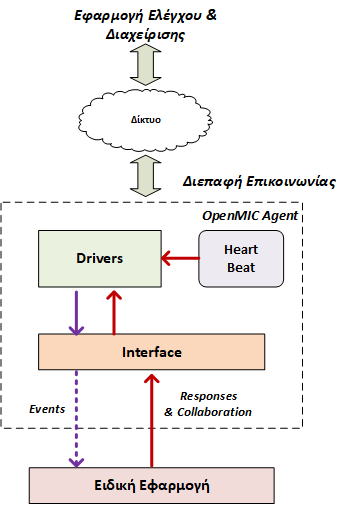
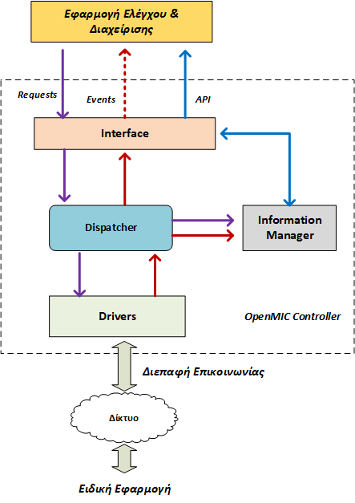

# Βιβλιοθήκη OpenMIC - Open Multi-Agent Intelligence and Computing 

## Περιγραφή

Η βιβλιοθήκη OpenMIC υποστηρίζει την ανάπτυξη συστημάτων που αποτελούνται από εφαρμογές που συνήθως τρέχουν σε διαφορετικές υπολογιστικές συσκευές, λειτουργούν αυτόνομα, συνεργάζονται μεταξύ τους, αλλά επίσης ορισμένες φορές είναι αναγκαίο να οργανώνονται κεντρικά.

Σε όλες αυτές τις περιπτώσεις υπάρχει ένα κοινό μοντέλο σχεδιασμού που περιλαμβάνει μια ειδική εφαρμογή που εκτελείται στις επιμέρους υπολογιστικές συσκευές και μια κεντρική οντότητα που αναλαμβάνει το συντονισμό της λειτουργίας και την απομακρυσμένη διαχείριση των ειδικών εφαρμογών. Επιπλέον, θα πρέπει υποχρεωτικά να υπάρχει ένας μηχανισμός που θα εξασφαλίζει την επικοινωνία για την ανταλλαγή μηνυμάτων και πληροφοριών μεταξύ των απομακρυσμένων εφαρμογών. Τέλος, ανεξαρτήτως από τον ακριβή σχεδιασμό  και τον τρόπο υλοποίησης υπάρχουν κοινές λειτουργίες και ανάγκες που πρέπει να υλοποιούνται στις εφαρμογές αυτών των συστημάτων, όπως για παράδειγμα η αποστολή μηνυμάτων, η λήψη απαντήσεων,  η ανεύρεση των διαθέσιμων συσκευών που φιλοξενούν τις ειδικές εφαρμογές. Επομένως, σε αυτές τις περιπτώσεις θα πρέπει να υλοποιούμε κάθε φορά από την αρχή όλες τις σχετικές λειτουργίες ώστε να μπορούν να ικανοποιηθούν οι απαιτήσεις 
συνεργασίας και κεντρικού ελέγχου και διαχείρισης.

Για το σκοπό αυτό, σχεδιάσαμε και υλοποιήσαμε μια ολοκληρωμένη βιβλιοθήκη λογισμικού (αποκλειστικά ανοιχτού κώδικα) γραμμένη στη γλώσσα προγραμματισμού Python που διευκολύνει την ανάπτυξη εφαρμογών με παρόμοιες απαιτήσεις. Η βιβλιοθήκη, που ονομάζουμε OpenMIC, είναι σχεδιασμένη ώστε να μπορεί άμεσα να αξιοποιηθεί και να επεκταθεί για την υλοποίηση εφαρμογών που βασίζονται στη συντονισμένη λειτουργία πολλαπλών συσκευών (Raspberry Pi 3, φορητών υπολογιστών, σταθμών εργασίας κ.λπ.).

Ένα από τα μεγαλύτερα πλεονεκτήματα της βιβλιοθήκης είναι ότι επιτρέπει στους προγραμματιστές να επικεντρωθούν στην λογική της εφαρμογής χωρίς να υπάρχει η ανάγκη υλοποίησης κάθε φορά από την αρχή των λειτουργιών επικοινωνίας, συνεργασίας και διαχείρισης. Επιπλέον, δίνει την δυνατότητα σε προγραμματιστές με μικρότερη εμπειρία να δημιουργούν πιο ενδιαφέρουσες και πολύπλοκες εφαρμογές.

Θεωρούμε ότι όλα τα συστήματα που μπορούν να αναπτυχθούν μέσω της βιβλιοθήκης OpenMIC περιλαμβάνουν πάντα μια κεντρική εφαρμογή ελέγχου και διαχείρισης, τον ελεγκτή (controller), που έχει την δυνατότητα να συντονίζει τις επιμέρους ειδικές εφαρμογές (agents) που τρέχουν σε διαφορετικές υπολογιστικές συσκευές

Η βιβλιοθήκη περιλαμβάνει τρία βασικά τμήματα:
* <b>OpenMIC Controller</b>: Αποτελεί την βάση για την δημιουργία της εφαρμογής ελέγχου και διαχείρισης.  Ενορχηστρώνει με αυτοματοποιημένο τρόπο την επικοινωνία μεταξύ των επιμέρους ειδικών εφαρμογών (agents) και του ελεγκτή, ώστε οι χρήστες της βιβλιοθήκης να μην χρειάζεται να ασχολούνται με λεπτομέρειες που έχουν να κάνουν με την επικοινωνία. Επίσης, παρέχει μεθόδους που επιτρέπουν την αποστολή εντολών σε όλες ή σε επιμέρους ειδικές εφαρμογές,  την αυτόματη λήψη των απαντήσεων και παρέχει στις ειδικές εφαρμογές την δυνατότητα ανταλλαγής μηνυμάτων συνεργασίας. Έχει σχεδιαστεί ώστε να διευκολύνει την ανάπτυξη των εφαρμογών ελέγχου. Επιπλέον, περιέχει βοηθητικές μεθόδους και λογική ώστε να γνωρίζει το πλήθος των ειδικών εφαρμογών που τρέχουν, να αναγνωρίζει νέες εκτελέσεις καθώς και να καταλαβαίνει αυτόματα πότε αποσυνδέονται . Όλη αυτή η λειτουργικότητα και οι σχετικές πληροφορίες είναι αυτομάτως διαθέσιμες σε όλες τις εφαρμογές που χρησιμοποιούν το συγκεκριμένο τμήμα της βιβλιοθήκης.
* <b>Διεπαφή επικοινωνίας</b>: Παρέχει μηχανισμούς για την αξιόπιστη επικοινωνία μεταξύ της εφαρμογής ελέγχου και των ειδικών εφαρμογών. Έχει σχεδιαστεί ώστε να υποστηρίζει πολλαπλά πρωτόκολλα και σχετικές τεχνολογίες. Στην τρέχουσα έκδοση υποστηρίζει την ανοιχτού κώδικα βιβλιοθήκη ανταλλαγής μηνυμάτων ZeroMQ  και το ανοιχτού κώδικα προηγμένο σύστημα ανταλλαγής μηνυμάτων RabbitMQ, ωστόσο μπορεί εύκολα να επεκταθεί. Οι χρήστες της βιβλιοθήκης δεν αλληλεπιδρούν με το συγκεκριμένο τμήμα, καθώς χρησιμοποιείται εσωτερικά από τα άλλα δύο για την υλοποίηση της συνολικής επικοινωνίας.
* <b>OpenMIC Agent</b>: Αποτελεί την βάση για την δημιουργία των ειδικών εφαρμογών. Η βιβλιοθήκη αυτόματα αναθέτει ένα μοναδικό αναγνωριστικό σε κάθε ειδική εφαρμογή, που την προσδιορίζει σε σχέση με τις άλλες που τρέχουν σε διαφορετικές υπολογιστικές συσκευές. Έχει την δυνατότητα να λαμβάνει αιτήματα/εντολές από τον ελεγκτή και να τα μεταβιβάζει στις ειδικές εφαρμογές για να εκτελεστούν. Επίσης, παρέχει μεθόδους που επιτρέπουν την αποστολή των αποτελεσμάτων κάποιου αιτήματος ή γενικών μηνυμάτων κατάστασης στην εφαρμογή διαχείρισης καθώς και την αποστολή μηνυμάτων συνεργασίας προς άλλες ειδικές εφαρμογές. 
Έχει σχεδιαστεί ώστε να διευκολύνει την ανάπτυξη των ειδικών εφαρμογών. Επιπλέον, περιέχει βοηθητικές μεθόδους και λογική ώστε να γνωρίζει το πλήθος των εντολών που πρέπει να διαχειριστεί και τις διαθέσιμες ειδικές εφαρμογές σε άλλες υπολογιστικές συσκευές. Όλη αυτή η λειτουργικότητα και οι σχετικές πληροφορίες είναι αυτομάτως διαθέσιμες σε όλες τις εφαρμογές που χρησιμοποιούν το συγκεκριμένο τμήμα της βιβλιοθήκης.

Η βιβλιοθήκη αποτελείται από μια σειρά από κλάσεις που βρίσκονται οργανωμένες σε πακέτα και παρέχουν όλη την απαραίτητη λειτουργικότητα. Πιο συγκεκριμένα υπάρχουν τα παρακάτω πακέτα:
* <b>agent</b>: Αντιστοιχεί στην υλοποίηση του OpenMIC Agent και περιλαμβάνει μια σειρά από κλάσεις που παρέχουν όλη την απαραίτητη λειτουργικότητα. Από αυτές (όπως θα δούμε στη συνέχεια) οι χρήστες αλληλεπιδρούν μόνο με δύο (<i>ΑgentInstance, AgentContext</i>) ενώ οι άλλες χρησιμοποιούνται εσωτερικά από την βιβλιοθήκη. 
* <b>controller</b>: Αντιστοιχεί στην υλοποίηση του OpenMIC Controller και περιλαμβάνει μια σειρά από κλάσεις που παρέχουν όλη την απαραίτητη λειτουργικότητα. Από αυτές (όπως θα δούμε στη συνέχεια) οι χρήστες αλληλεπιδρούν μόνο με δύο (<i>ControllerInstance, ControllerContext</i>) ενώ οι άλλες χρησιμοποιούνται εσωτερικά από την βιβλιοθήκη.
* <b>drivers</b>: Περιέχει την υλοποίηση των μηχανισμών της διεπαφής επικοινωνίας. Πιο συγκεκριμένα για κάθε πρωτόκολλο που υποστηρίζει η βιβλιοθήκη θα πρέπει να υπάρχει η αντίστοιχη κλάση. Οι συγκεκριμένες λειτουργίες αξιοποιούνται εσωτερικά από τα δύο προηγούμενα πακέτα. 
* <b>lib</b>: Περιλαμβάνει βοηθητικές κλάσεις.
* <b>utils</b>: Περιλαμβάνει συμπληρωματικές λειτουργίες που  διευκολύνουν τους χρήστες να προσδιορίζουν τις απαραίτητες παραμέτρους σχετικά με την διεπαφή επικοινωνίας.

Στη συνέχεια θα παρουσιάσουμε, χωρίς πολλές τεχνικές λεπτομέρειες την οργάνωση του <i>OpenMIC Agent</i> και <i>OpenMIC Controller</i>, καθώς οι συγκεκριμένες πληροφορίες είναι σημαντικές για την καλύτερη κατανόηση του τρόπου λειτουργίας και αξιοποίησης της βιβλιοθήκης για την δημιουργία νέων εφαρμογών.

#### A. OpenMIC Agent

Στο σχήμα που ακολουθεί φαίνεται η εσωτερική οργάνωση, για κάθε στοιχείο υπάρχει και η αντίστοιχη κλάση στο πακέτο <i>openmic.agent</i>

Οι χρήστες αλληλεπιδρούν μόνο με το <i>Interface</i> μέσω της κλάσης <i>AgentInstance</i> που δέχεται ως παράμετρο ένα αντικείμενο της βοηθητικής κλάσης <i>AgentContext</i>. H <i>AgentContext</i> παρέχει μεθόδους που επιτρέπουν στους χρήστες να καθορίζουν διάφορες παραμέτρους σχετικά με την λειτουργία του OpenMIC Agent και της διεπαφής επικοινωνίας.

Η κλάση <i>AgentInstance</i> περιλαμβάνει μια σειρά από μεθόδους με τις οποίες μια εφαρμογή που βασίζεται στην βιβλιοθήκη OpenMIC μπορεί να συνεργάζεται με άλλες εφαρμογές καθώς επίσης να απαντά στις εντολές της εφαρμογής διαχείρισης και να στέλνει γενικά μηνύματα.

Συνοπτικά οι διαθέσιμες μέθοδοι είναι:
* <b>send_response</b>:  Αποστολή προς την εφαρμογή διαχείρισης του αποτελέσματος από κάποιο συγκεκριμένο αίτημά της.
* <b>basic_monitoring</b>: Επιστρέφει στην ειδική εφαρμογή βασικές πληροφορίες κατάστασης για την υπολογιστική συσκευή που την φιλοξενεί.
* <b>available_agents</b>: Αποστολή ενός αιτήματος προς την ειδική εφαρμογή ώστε να λάβει την πλήρη λίστα με όλες τις άλλες διαθέσιμες ειδικές εφαρμογές. 
* <b>gent_to_agents_request</b>: Αποστολή κάποιου μηνύματος προς μια ή περισσότερες ειδικές εφαρμογές
* <b>agent_general_message</b>: Αποστολή προς την εφαρμογή διαχείρισης κάποιου γενικού μηνύματος που δεν σχετίζεται με κάποιο αίτημα από την εφαρμογή διαχείρισης. 

Ακόμη, οι ειδικές εφαρμογές ενημερώνονται για τα μηνύματα από την εφαρμογή διαχείρισης και τις άλλες ειδικές εφαρμογές μέσω ενός απλού μηχανισμού εγγραφής και παρακολούθησης συγκεκριμένων γεγονότων.

Τα διαθέσιμα γεγονότα για τις ειδικές εφαρμογές είναι:
* <b>EventControllerRequest</b>: Αντιστοιχεί στην περίπτωση που η ειδική εφαρμογή λαμβάνει μια εντολή από την εφαρμογή διαχείρισης.
* <b>EventAvailableAgents</b>: Αντιστοιχεί στην περίπτωση που η ειδική εφαρμογή λαμβάνει από την εφαρμογή διαχείρισης την λίστα με όλες τις άλλες διαθέσιμες ειδικές εφαρμογές. Ουσιαστικά, είναι ο τρόπος που λαμβάνουμε τις πληροφορίες όταν  χρησιμοποιούμε την μέθοδο <i>available_agents()</i>. 
* <b>EventAgentCollaboration</b>: Αντιστοιχεί στην περίπτωση που η ειδική εφαρμογή λαμβάνει ένα μήνυμα από κάποια άλλη ειδική εφαρμογή, στα πλαίσια της υλοποίησης κάποιου σεναρίου συνεργασίας.

Τέλος, η κλάση <i>AgentInstance</i>  στέλνει αυτόματα σε συγκεκριμένα διαστήματα  σύντομες πληροφορίες σχετικά με την τρέχουσα κατάσταση της υπολογιστικής συσκευής προς την εφαρμογή διαχείρισης. Οι συγκεκριμένες πληροφορίες μεταβιβάζονται από τον OpenMIC Controller στις εφαρμογές των χρηστών αλλά αξιοποιούνται και εσωτερικά ώστε να αναγνωρίζουμε τις περιπτώσεις που υπάρχει απώλεια επικοινωνίας από κάποια ειδική εφαρμογή.

#### B. OpenMIC Controller

 
## Εγκατάσταση

Αναλυτικές οδηγίες για την εγκατάσταση της βιβλιοθήκης σε κάποια υπολογιστική συσκευή υπάρχουν στο [σύνδεσμο](../code/README.md)
 
## Δημιουργία εφαρμογών
