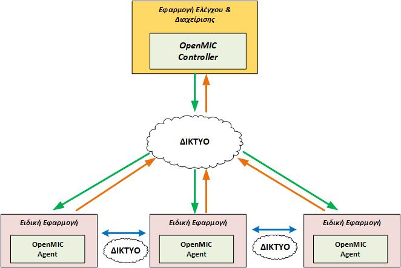

# Βιβλιοθήκη OpenMIC - Open Multi-Agent Intelligence and Computing 

## Περιγραφή

Η βιβλιοθήκη OpenMIC υποστηρίζει την ανάπτυξη συστημάτων που αποτελούνται από εφαρμογές που συνήθως τρέχουν σε διαφορετικές υπολογιστικές συσκευές, λειτουργούν αυτόνομα, συνεργάζονται μεταξύ τους, αλλά επίσης ορισμένες φορές είναι αναγκαίο να οργανώνονται κεντρικά.

Σε όλες αυτές τις περιπτώσεις υπάρχει ένα κοινό μοντέλο σχεδιασμού που περιλαμβάνει μια ειδική εφαρμογή που εκτελείται στις επιμέρους υπολογιστικές συσκευές και μια κεντρική οντότητα που αναλαμβάνει το συντονισμό της λειτουργίας και την απομακρυσμένη διαχείριση των ειδικών εφαρμογών. Επιπλέον, θα πρέπει υποχρεωτικά να υπάρχει ένας μηχανισμός που θα εξασφαλίζει την επικοινωνία για την ανταλλαγή μηνυμάτων και πληροφοριών μεταξύ των απομακρυσμένων εφαρμογών. Τέλος, ανεξαρτήτως από τον ακριβή σχεδιασμό  και τον τρόπο υλοποίησης υπάρχουν κοινές λειτουργίες και ανάγκες που πρέπει να υλοποιούνται στις εφαρμογές αυτών των συστημάτων, όπως για παράδειγμα η αποστολή μηνυμάτων, η λήψη απαντήσεων,  η ανεύρεση των διαθέσιμων συσκευών που φιλοξενούν τις ειδικές εφαρμογές.

Για το σκοπό αυτό, σχεδιάσαμε και υλοποιήσαμε μια ολοκληρωμένη βιβλιοθήκη λογισμικού (αποκλειστικά ανοιχτού κώδικα) γραμμένη στη γλώσσα προγραμματισμού Python που διευκολύνει την ανάπτυξη εφαρμογών με παρόμοιες απαιτήσεις. Η βιβλιοθήκη είναι σχεδιασμένη ώστε να μπορεί άμεσα να αξιοποιηθεί και να επεκταθεί για την υλοποίηση εφαρμογών που βασίζονται στη συντονισμένη λειτουργία πολλαπλών συσκευών (Raspberry Pi 3, φορητών υπολογιστών, σταθμών εργασίας κ.λπ.). 

Έχουμε θεωρήσει ότι κάθε σύστημα που μπορεί να αναπτυχθεί μέσω της βιβλιοθήκης OpenMIC περιλαμβάνει μια κεντρική εφαρμογή, τον ελεγκτή (controller) που έχει την δυνατότητα να συντονίζει τις επιμέρους ειδικές εφαρμογές (agents) που τρέχουν σε διαφορετικές υπολογιστικές συσκευές.

Η βιβλιοθήκη περιλαμβάνει τρία βασικά τμήματα:
* <b>OpenMIC Controller</b>: Αποτελεί την βάση για την δημιουργία της εφαρμογής ελέγχου. Ενορχηστρώνει με αυτοματοποιημένο τρόπο την επικοινωνία μεταξύ των επιμέρους ειδικών εφαρμογών (agents) και του ελεγκτή, ώστε οι χρήστες της βιβλιοθήκης να μην χρειάζεται να ασχολούνται με λεπτομέρειες που έχουν να κάνουν με την επικοινωνία. Επίσης, παρέχει μεθόδους που επιτρέπουν την αποστολή εντολών σε όλες ή σε επιμέρους ειδικές εφαρμογές,  την αυτόματη λήψη των απαντήσεων και παρέχει στις ειδικές εφαρμογές την δυνατότητα ανταλλαγής μηνυμάτων συνεργασίας. Έχει σχεδιαστεί ώστε να διευκολύνει την ανάπτυξη των εφαρμογών ελέγχου. Επιπλέον, περιέχει βοηθητικές μεθόδους και λογική ώστε να γνωρίζει το πλήθος των ειδικών εφαρμογών που τρέχουν, να αναγνωρίζει νέες εκτελέσεις καθώς και να καταλαβαίνει αυτόματα πότε αποσυνδέονται . Όλη αυτή η λειτουργικότητα και οι σχετικές πληροφορίες είναι αυτομάτως διαθέσιμες σε όλες τις εφαρμογές που χρησιμοποιούν το συγκεκριμένο τμήμα της βιβλιοθήκης.
* <b>Διεπαφή επικοινωνίας</b>: Παρέχει μηχανισμούς για την αξιόπιστη επικοινωνία μεταξύ της εφαρμογής ελέγχου και των ειδικών εφαρμογών. Έχει σχεδιαστεί ώστε να υποστηρίζει πολλαπλά πρωτόκολλα και σχετικές τεχνολογίες. Στην τρέχουσα έκδοση υποστηρίζει την ανοιχτού κώδικα βιβλιοθήκη ανταλλαγής μηνυμάτων ZeroMQ  και το ανοιχτού κώδικα προηγμένο σύστημα ανταλλαγής μηνυμάτων RabbitMQ, ωστόσο μπορεί εύκολα να επεκταθεί. Οι χρήστες της βιβλιοθήκης δεν αλληλεπιδρούν με το συγκεκριμένο τμήμα, καθώς χρησιμοποιείται εσωτερικά από τα άλλα δύο για την υλοποίηση της συνολικής επικοινωνίας.
* <b>OpenMIC Agent</b>: Αποτελεί την βάση για την δημιουργία των ειδικών εφαρμογών. Η βιβλιοθήκη αυτόματα αναθέτει ένα μοναδικό αναγνωριστικό σε κάθε ειδική εφαρμογή, που την προσδιορίζει σε σχέση με τις άλλες που τρέχουν σε διαφορετικές υπολογιστικές συσκευές. Έχει την δυνατότητα να λαμβάνει αιτήματα/εντολές από τον ελεγκτή και να τα μεταβιβάζει στις ειδικές εφαρμογές για να εκτελεστούν. Επίσης, παρέχει μεθόδους που επιτρέπουν την αποστολή των αποτελεσμάτων κάποιου αιτήματος ή γενικών μηνυμάτων κατάστασης στην εφαρμογή διαχείρισης καθώς και την αποστολή μηνυμάτων συνεργασίας προς άλλες ειδικές εφαρμογές. Έχει σχεδιαστεί ώστε να διευκολύνει την ανάπτυξη των ειδικών εφαρμογών. Επιπλέον, περιέχει βοηθητικές μεθόδους και λογική ώστε να γνωρίζει το πλήθος των εντολών που πρέπει να διαχειριστεί και τις διαθέσιμες ειδικές εφαρμογές σε άλλες υπολογιστικές συσκευές. Όλη αυτή η λειτουργικότητα και οι σχετικές πληροφορίες είναι αυτομάτως διαθέσιμες σε όλες τις εφαρμογές που χρησιμοποιούν το συγκεκριμένο τμήμα της βιβλιοθήκης.
 
